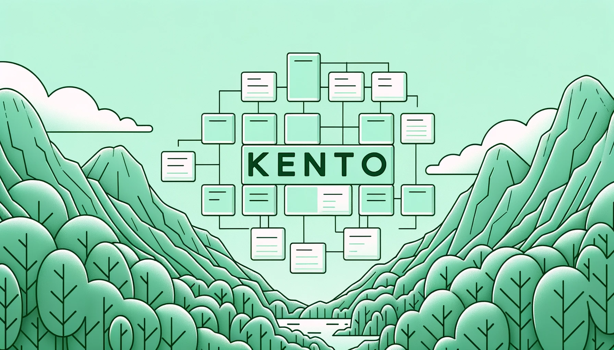

||||
|---|---|---|

Welcome to the Core API of Kento, a robust and scalable backend solution inspired by popular task management platforms like Trello and Jira. Our aim is to provide a seamless experience for managing projects and their associated task boards. Whether you're a small team looking to keep track of your tasks or a large organization aiming to streamline your project management processes, this API has got you covered.

Built with cutting-edge technologies like NestJS, TypeScript, and GraphQL, this project ensures high performance, security, and ease of use. With Mikro-ORM for object-relational mapping, we ensure smooth interactions with the database, and with the upcoming addition of Redis, users can expect even faster response times due to efficient caching.

The modular architecture allows for easy scalability and maintenance. Each module, such as Auth, Board, and Project, has been meticulously crafted to handle its specific functionalities, ensuring a clean and organized codebase.

Dive into the details below to understand more about the individual modules, entities, and the requirements to get this project up and running.

## Table of Contents

- [Modules](#modules)
  - [Auth Module](#auth-module)
  - [Board Module](#board-module)
  - [Project Module](#project-module)
- [Entities](#entities)
  - [User Entity](#user-entity)
  - [Board Entity](#board-entity)
  - [Project Entity](#project-entity)
- [Requirements to Run the Project](#requirements-to-run-the-project)

## Modules

### [Auth Module](https://github.com/kent-0/api/tree/main/src/modules/auth)
- Responsible for user authentication and authorization.
- Contains services, controllers, and entities related to authentication.

### [Board Module](https://github.com/kent-0/api/tree/main/src/modules/board)
- Manages the project's task boards.
- Includes functionalities to create, edit, and delete boards.

### [Project Module](https://github.com/kent-0/api/tree/main/src/modules/project)
- In charge of project management.
- Allows for the creation, editing, and deletion of projects.

## Entities

### [User Entity](https://github.com/kent-0/api/tree/main/src/database/entities/auth)
- Represents a user in the system.
- Contains attributes such as ID, name, email, among others.

### [Board Entity](https://github.com/kent-0/api/tree/main/src/database/entities/board)
- Represents a task board.
- Includes attributes like ID, board name, description, among others.

### [Project Entity](https://github.com/kent-0/api/tree/main/src/database/entities/project)
- Represents a project in the system.
- Contains attributes like ID, project name, description, among others.

## Requirements to Run the Project

1. **Node.js**: Ensure you have Node.js installed.
2. **NestJS**: The project is built using the NestJS framework.
3. **TypeScript**: Ensure TypeScript is installed globally or as a project dependency.
4. **Mikro-ORM**: Required for object-relational mapping.
5. **GraphQL**: Ensure the necessary GraphQL packages are installed.
6. **PostgreSQL**: The project uses PostgreSQL as its database. Ensure you have PostgreSQL set up and running.
7. **Redis** (Upcoming): Will be used for caching in the future. Ensure you have Redis installed if you plan to implement caching.
